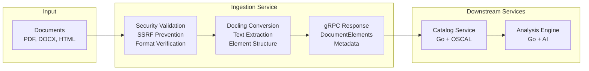

# CrossCodex Ingestion Service

----

> 🤖 LLM WARNING 🤖
>
> This project was written with LLM (AI) assistance.
>
> 🤖 LLM WARNING 🤖

----

Python gRPC service that wraps Docling to provide secure, multi-format document conversion for the CrossCodex multi-service compliance mapping platform.

## Purpose

The Ingestion service handles the first stage of the CrossCodex pipeline:

1. **Document Format Conversion**: PDF, DOCX, HTML, and other formats → structured text and elements
2. **Security Hardening**: SSRF prevention, format validation, resource limits, subprocess isolation  
3. **gRPC Interface**: Stateless service that integrates with Go-based CrossCodex services

**Important**: This service handles format conversion only. OSCAL catalog structuring (section detection, decomposition, LLM-assisted extraction) has been moved to the Go-based Catalog service in the main repository.

## Architecture Integration



The Ingestion service is stateless and security-focused - it receives documents, converts them via Docling, and returns structured elements without maintaining any OSCAL knowledge or business logic.

## gRPC API

### Service Definition

```protobuf
service IngestionService {
  rpc ConvertDocument(ConvertDocumentRequest) returns (ConvertDocumentResponse);
  rpc Health(HealthRequest) returns (HealthResponse);
}

message ConvertDocumentRequest {
  bytes document = 1;
  string format = 2;  // "pdf", "docx", "html", etc.
  ConvertOptions options = 3;
}

message ConvertDocumentResponse {
  repeated DocumentElement elements = 1;
  ConvertMetadata metadata = 2;
}

message DocumentElement {
  string type = 1;      // "heading", "paragraph", "table", etc.
  string content = 2;   // extracted text
  int32 page = 3;       // source page number
  ElementStyle style = 4;
}
```

### Example Usage

```python
import grpc
from crosscodex.v1 import ingestion_pb2_grpc, ingestion_pb2

# Connect to service
channel = grpc.insecure_channel('localhost:8080')
client = ingestion_pb2_grpc.IngestionServiceStub(channel)

# Convert document
with open('document.pdf', 'rb') as f:
    request = ingestion_pb2.ConvertDocumentRequest(
        document=f.read(),
        format='pdf'
    )
    response = client.ConvertDocument(request)
    
    for element in response.elements:
        print(f"{element.type}: {element.content[:100]}...")
```

## Development Setup

### Prerequisites

- Python 3.9 or higher
- pip or poetry for dependency management
- Docker/Podman (for containerized development)

### Local Development

```bash
# Clone and setup
git clone https://github.com/complytime-labs/crosscodex-ingestion
cd crosscodex-ingestion

# Install dependencies
pip install -r requirements.txt
pip install -e .

# Install development dependencies
pip install -r requirements-dev.txt

# Generate gRPC stubs (if proto files updated)
python -m grpc_tools.protoc \
    --python_out=src/ \
    --grpc_python_out=src/ \
    --proto_path=proto/ \
    crosscodex/v1/*.proto

# Run service locally
python -m crosscodex_ingestion.server --port 8080 --log-level debug

# Run with auto-reload for development
python -m crosscodex_ingestion.server --port 8080 --debug --reload
```

### Integration with Main Repository

The ingestion service integrates with CrossCodex monorepo testing:

```bash
# In main crosscodex repository
task test:integration:embedded    # Starts ingestion service automatically
task test:integration:distributed # Uses ingestion container
```

### Proto Stub Updates

This repository consumes proto-generated Python stubs from the main CrossCodex monorepo:

```bash
# Install specific proto version
pip install crosscodex-proto==0.1.0

# Update to latest (check compatibility first)
pip install --upgrade crosscodex-proto
```

The main repository's CI publishes `crosscodex-proto` Python package to GitHub Packages when proto definitions change.

## Security Features

### SSRF Prevention

```python
# Allowlisted schemes and domains
ALLOWED_SCHEMES = ['http', 'https', 'file']
BLOCKED_DOMAINS = ['localhost', '127.0.0.1', '169.254.169.254']
BLOCKED_NETWORKS = ['10.0.0.0/8', '192.168.0.0/16', '172.16.0.0/12']

def validate_url(url: str) -> bool:
    """Prevent Server-Side Request Forgery attacks"""
    parsed = urllib.parse.urlparse(url)
    
    if parsed.scheme not in ALLOWED_SCHEMES:
        raise ValueError(f"Scheme {parsed.scheme} not allowed")
    
    # Additional validation...
```

### Format Validation

```python
# Strict format allowlist
ALLOWED_FORMATS = {
    'pdf': ['application/pdf'],
    'docx': ['application/vnd.openxmlformats-officedocument.wordprocessingml.document'],
    'html': ['text/html', 'application/xhtml+xml'],
    'txt': ['text/plain']
}

def validate_document_format(content: bytes, declared_format: str) -> bool:
    """Validate document format matches declaration"""
    detected_mime = magic.from_buffer(content, mime=True)
    return detected_mime in ALLOWED_FORMATS.get(declared_format, [])
```

### Resource Limits

```python
# Memory and processing limits
MAX_DOCUMENT_SIZE = 50 * 1024 * 1024  # 50MB
MAX_PROCESSING_TIME = 300  # 5 minutes
MAX_PAGES = 1000
MAX_EXTRACTION_LENGTH = 10 * 1024 * 1024  # 10MB text

@timeout(MAX_PROCESSING_TIME)
def convert_document(document: bytes) -> List[DocumentElement]:
    if len(document) > MAX_DOCUMENT_SIZE:
        raise ValueError("Document too large")
    # Processing...
```

### Subprocess Isolation

```python
import subprocess
import tempfile
import os

def run_docling_isolated(input_path: str, output_path: str) -> None:
    """Run Docling in isolated subprocess with resource limits"""
    with tempfile.TemporaryDirectory() as temp_dir:
        # Copy input to isolated temp directory
        isolated_input = os.path.join(temp_dir, 'input.pdf')
        shutil.copy2(input_path, isolated_input)
        
        # Run with resource limits
        subprocess.run([
            'docling', '--input', isolated_input, '--output', output_path
        ], 
        timeout=MAX_PROCESSING_TIME,
        cwd=temp_dir,
        env={'PATH': os.environ['PATH']})  # Minimal environment
```

## Testing

### Test Structure

```
tests/
  unit/
    test_security.py           # SSRF, format validation, limits
    test_conversion.py         # Document processing logic
    test_grpc_server.py        # gRPC service behavior
  integration/
    test_docling_integration.py # Real Docling conversion
    test_crosscodex_e2e.py      # End-to-end with main system
  fixtures/
    documents/                 # Test documents (various formats)
    expected_outputs/          # Expected conversion results
```

### Running Tests

```bash
# Unit tests only
pytest tests/unit/ -v

# Integration tests (requires Docling)
pytest tests/integration/ -v

# Security-focused tests
pytest tests/unit/test_security.py -v

# Test with coverage
pytest --cov=crosscodex_ingestion --cov-report=html

# Performance tests
pytest tests/performance/ -v --benchmark-only
```

### Mock gRPC Client for Testing

```python
import grpc_testing
from crosscodex.v1 import ingestion_pb2, ingestion_pb2_grpc

def test_convert_document():
    # Setup mock gRPC
    servicers = {
        ingestion_pb2.DESCRIPTOR.services_by_name['IngestionService']: 
        MockIngestionService()
    }
    
    channel = grpc_testing.channel(servicers, grpc_testing.strict_real_time())
    client = ingestion_pb2_grpc.IngestionServiceStub(channel)
    
    # Test conversion
    request = ingestion_pb2.ConvertDocumentRequest(
        document=b"test pdf content",
        format="pdf"
    )
    
    response = client.ConvertDocument(request)
    assert len(response.elements) > 0
```

### Security Test Examples

```python
def test_ssrf_prevention():
    """Test that SSRF attempts are blocked"""
    malicious_urls = [
        'http://localhost:8080/admin',
        'http://169.254.169.254/metadata',
        'file:///etc/passwd'
    ]
    
    for url in malicious_urls:
        with pytest.raises(ValueError):
            validate_url(url)

def test_document_size_limit():
    """Test that oversized documents are rejected"""
    large_document = b'x' * (MAX_DOCUMENT_SIZE + 1)
    
    with pytest.raises(ValueError, match="Document too large"):
        convert_document(large_document)

def test_format_validation():
    """Test that format spoofing is detected"""
    # PDF content with HTML extension claim
    pdf_content = b'%PDF-1.4...'
    
    with pytest.raises(ValueError, match="Format mismatch"):
        validate_document_format(pdf_content, 'html')
```

## Deployment

### Container Build

```bash
# Standard build
docker build -t crosscodex-ingestion:latest .

# FIPS build (Red Hat UBI with FIPS OpenSSL)
docker build -f Dockerfile.fips -t crosscodex-ingestion:latest-fips .

# Multi-architecture build
docker buildx build --platform linux/amd64,linux/arm64 -t crosscodex-ingestion:latest .
```

### Configuration

Environment variables for container deployment:

```bash
# Service configuration
GRPC_PORT=8080
LOG_LEVEL=info
METRICS_PORT=9090

# Security settings
MAX_DOCUMENT_SIZE=52428800    # 50MB
MAX_PROCESSING_TIME=300       # 5 minutes
ALLOWED_FORMATS=pdf,docx,html,txt

# Integration
HEALTH_CHECK_INTERVAL=30
GRACEFUL_SHUTDOWN_TIMEOUT=10
```

### RPM Packaging

For air-gapped environments, the service is packaged as an RPM:

```bash
# Build RPM
python setup.py bdist_rpm

# Install RPM
sudo dnf localinstall dist/crosscodex-ingestion-*.rpm

# Service management
sudo systemctl enable crosscodex-ingestion
sudo systemctl start crosscodex-ingestion
sudo journalctl -u crosscodex-ingestion -f
```

### Health Checks

```python
# Docker health check
HEALTHCHECK --interval=30s --timeout=10s --start-period=5s --retries=3 \
  CMD python -m crosscodex_ingestion.health_check || exit 1

# Kubernetes liveness/readiness
GET /health/live   -> 200 OK (service running)
GET /health/ready  -> 200 OK (service ready to accept requests)
```

## Integration Points

### With Main CrossCodex System

1. **Pipeline Integration**: Catalog service calls Ingestion via gRPC
2. **Error Handling**: Failed conversions propagate as structured errors
3. **Observability**: Traces, metrics, and logs integrate with CrossCodex telemetry
4. **Authentication**: Service-to-service mTLS in distributed mode
5. **Storage Integration**: Conversion metadata stored in PostgreSQL via Catalog service
6. **Message Bus**: Error events and audit trails published to NATS JetStream

### Development Workflow

1. **Proto Changes**: Update proto files in main repo, rebuild stubs
2. **Feature Development**: Implement in this repo, test against main system
3. **Version Alignment**: Pin to compatible proto versions, test integration
4. **Release**: Tag this repo, update main repo's kustomize/deployment files

## Security Design

### Core Security Features
- SSRF prevention with strict URL validation
- Document format validation patterns
- Resource limit enforcement
- Subprocess isolation approach

### Service Architecture
- **Pure format conversion** - no business logic or OSCAL knowledge
- **gRPC interface** for stateless service integration
- **Container deployment** with minimal attack surface

### Security Hardening
- Strict format allowlists
- Memory limit enforcement  
- Timeout protection on all operations
- Isolated temporary directories
- Minimal container attack surface

## Support

- **Issues**: [GitHub Issues](https://github.com/complytime-labs/crosscodex-ingestion/issues)
- **Main Project**: [CrossCodex Repository](https://github.com/complytime-labs/crosscodex)
- **Docling**: [Document extraction library](https://github.com/DS4SD/docling)
